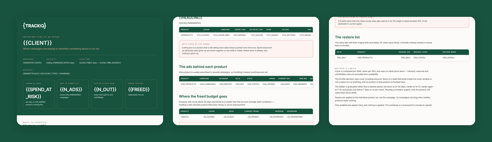

# TrackIQ: Amazon Inventory Risk → Ad Spend Throttle

A stockout destroys organic rank **and** wastes ad spend at the same time. Nobody does this join by hand because it spans two systems.

**Which campaigns are paying to advertise something about to go out of stock, and where should that money go instead?**

Part of **Amazon Inventory** in the
[TrackIQ skills catalog](https://github.com/TrackIQ-HQ/amazon-seller-skills).

Built as an [Agent Skill](https://code.claude.com/docs/en/skills). Runs in
Claude Code, Claude web, Claude desktop and ChatGPT from the same folder.

---

## Powered by the TrackIQ MCP

[](https://trackiq.com/mcp)

This skill reads your live Amazon account through the
**[TrackIQ MCP](https://trackiq.com/mcp)** — 16 tools connecting your AI
assistant to Amazon data:

Sales & Traffic · Orders · Inventory · Returns · Sponsored Products · Sponsored
Brands · Sponsored Display · Amazon DSP · AMC Cloud · Keywords · Search Terms ·
Targeting · Search Query Performance · Organic Rank · Best Seller Rank · Buy Box
History · Brand Analytics · Export

Works with Claude, ChatGPT and Cursor. **[Get access →](https://trackiq.com/mcp)**

---

## What you get



Finds the Amazon campaigns still paying to advertise products that are about to run out of stock, and produces an upload-ready bulk file that throttles or pauses those ads with the real campaign, ad group and ad IDs attached — plus where the freed budget should go instead. Use when the user asks about advertising products that are out of stock, throttling ads on low inventory, wasted spend on stockouts, protecting rank before a stockout, or which campaigns to pause because stock is low.

### The rules that keep it honest

- **Cover is computed per ASIN, never per SKU**
- **Cover uses `on_hand`, never `total`**
- **`get_product_ads` is the join and it carries real IDs**
- **One ASIN is usually advertised in several campaigns**

The full list is in `SKILL.md`, and each one exists because getting it wrong
produces a confident, wrong answer rather than an obvious error.

## Requirements

- The TrackIQ MCP, for `list_marketplaces`, `get_inventory_snapshot`, `get_product_performance`, `get_product_ads` and `get_campaigns`. - **A lead time** — days from purchase order to sellable. Ask for it; it is in no tool. Default 45 days, labelled an assumption. - Nothing else. No filesystem, no shell, no internet. - **Without the MCP:** works from an FBA inventory export plus an advertised-ASIN report with campaign and ad group IDs.

---

## Install

### Claude Code

```
/plugin marketplace add TrackIQ-HQ/amazon-seller-skills
/plugin install trackiq-amazon-inventory-ad-throttle@trackiq
```

### Claude web, desktop, mobile

1. Download the `.zip` from the
   [latest release](https://github.com/TrackIQ-HQ/trackiq-amazon-inventory-ad-throttle/releases)
2. **Settings → Capabilities → Skills** (code execution must be on)
3. **Create skill → Upload a skill**, choose the `.zip`
4. Toggle it on

### ChatGPT

Same zip. **Plugins → Skills → Create → Upload from your computer.**

---

## Setup

Answers live in `account.md`, copied from
[`assets/account.example.md`](skills/trackiq-amazon-inventory-ad-throttle/assets/account.example.md).
**Every TrackIQ skill reads the same file**, so an account already set up for
another TrackIQ report needs nothing added.

## Delivery

Asked once and stored in `account.md`: **in-chat** (default), **file**,
**Slack**, **n8n** or **email**. Anything leaving the chat confirms with you
first and falls back to in-chat, with a note.

---

## Customizing

| File | What it controls |
|---|---|
| `checks.md` | the pre-send checks |
| `method.md` | the method and every threshold |
| `pulls.md` | the call sequence and its traps |
| `report-template.html` | the report shell |

---

## Contributing

```bash
python scripts/validate.py    # must exit 0 before any commit
python scripts/build.py       # writes dist/ zip + registry.json
```

Read [AUTHORING.md](https://github.com/TrackIQ-HQ/amazon-seller-skills/blob/main/AUTHORING.md)
before proposing changes.

## License

MIT. See [LICENSE](LICENSE).
